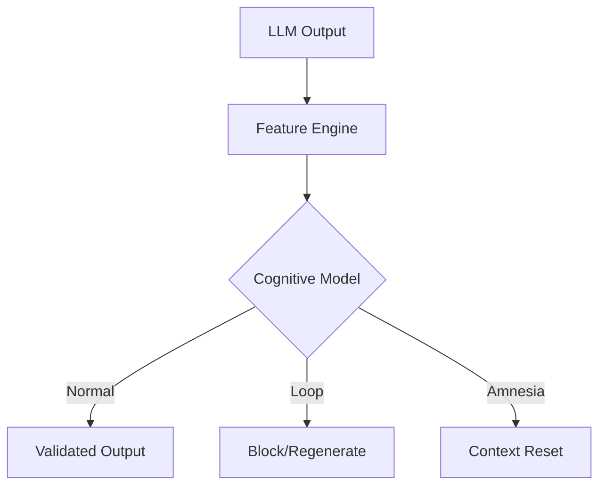

<div align="center">

# 🧠 YecoAI Mini-LLM Cognitive Layer

### Ultra-lightweight cognitive protection for Large Language Models
**Anti-loop • Amnesia detection • Semantic stability**

<br/>

[](LICENSE)


<br/>


Developed by **[www.yecoai.com](https://www.yecoai.com)**

</div>

---

## ✨ What is the Cognitive Layer?

The **YecoAI Mini-LLM Cognitive Layer** is a lightweight, deterministic guard module designed to sit on top of any LLM (GPT-4, Claude, Llama, etc.).

It doesn't replace the model; instead, it acts as a **real-time monitoring system** that observes, evaluates, and stabilizes the model's output before it reaches the end user or an autonomous agent.

### Solves critical production issues:
- **Infinite Loops:** Blocks obsessive repetition of tokens or phrases.
- **Context Loss (Amnesia):** Detects when the model "forgets" initial instructions or collapses semantically.
- **Semantic Degradation:** Identifies "word salad" in very long conversations.
- **Agent Instability:** Protects autonomous workflows from erroneous recursive behaviors.

---

## 🧩 Core Capabilities

- 🔁 **Multi-level Loop Detector**
  Analyzes structural patterns, n-grams, and semantic repetitions with a precision (F1) of 0.90.
- 🧠 **Amnesia Detection**
  Monitors contextual continuity across conversation turns.
- 🧯 **Semantic Stability Guard**
  Prevents meaning collapse and nonsensical text output.
- ⚡ **Performance Edge**
  Average RAM usage of only **38.85 MB**. Ideal for deployment on edge devices and embedded systems.

---

## 🚀 Practical Examples

### 1. Installation
```bash
pip install yecoai-cognitive-layer
```

### 2. Protecting an LLM Chatbot (Production Pattern)
This example shows how to use the layer as a "Validator" for a standard LLM response.

```python
from yecoai_cognitive_layer import FeatureEngine, CognitiveModel

# 1. Setup the guards
engine = FeatureEngine()
model = CognitiveModel.load_from_json("weights.json")

def get_safe_llm_response(prompt):
    # Simulate an LLM call (e.g., OpenAI, Anthropic, or Local Llama)
    llm_output = call_your_llm_api(prompt) 
    
    # 2. Cognitive Validation
    vector, features = engine.extract_features(llm_output)
    prediction, scores = model.predict(vector, features)
    
    # 3. Decision Logic
    if prediction == "Loop":
        # If the LLM starts repeating itself, we trigger a retry or a fallback
        return "⚠️ [System Blocked a Loop] Please rephrase your request."
    
    if prediction == "Amnesia" or features['semantic_coherence'] < 0.25:
        # If the response is nonsensical or context is lost
        return "🧠 [Context Loss Detected] I'm having trouble following. Let's restart."

    return llm_output

# Usage
print(get_safe_llm_response("Write a long story about..."))
```

### 3. Agent Self-Correction Loop
For autonomous agents, you can use the layer to detect when the agent is "stuck" in a reasoning loop before it consumes too many tokens.

```python
agent_history = []

while agent_running:
    action = agent.think()
    
    # Analyze the agent's thought process
    _, features = engine.extract_features(action)
    
    if features['repetition_score'] > 0.7 or features['struct_loop_flag'] > 0.5:
        print("🚨 Agent Loop Detected! Injecting 'Break Loop' instruction.")
        agent.inject_system_message("You are repeating yourself. Stop and try a different approach.")
        continue
        
    agent.execute(action)
```

---

## 📊 Benchmarks (v1.0 - Real Stress Tests)

| Metric | Result |
| :--- | :--- |
| **Total Accuracy** | **76.06%** |
| **Loop Detection (F1)** | **0.90** |
| **Normal Detection (F1)** | **0.71** |
| **Amnesia Detection (F1)** | **0.63** |
| **Average RAM** | **38.85 MB** |

---

## 🏗️ System Architecture



---

## 🏷️ Attribution & Credits (Required)

This project is developed and maintained by **YecoAI**.
Attribution is **REQUIRED** for any usage, including:
- Modified versions
- Commercial products and SaaS platforms
- Research publications

You must retain this README, the `LICENSE` file, and the `NOTICE` file.

---

## 📄 License

Distributed under the **Apache License 2.0**.
✔ Commercial use allowed
✔ Modifications allowed
✔ Redistribution allowed

---

## 🌐 About Us: YecoAI

**YecoAI** builds next-generation cognitive systems focused on AI stability and safety.

**Website:** [www.yecoai.com](https://www.yecoai.com) | **Discord:** [Join Community](https://discord.gg/rBZscZtMvX)

<div align="center">

© 2026 **[www.yecoai.com](https://www.yecoai.com)**  
Original Author: **Marco (HighMark / YecoAI)**

</div>
